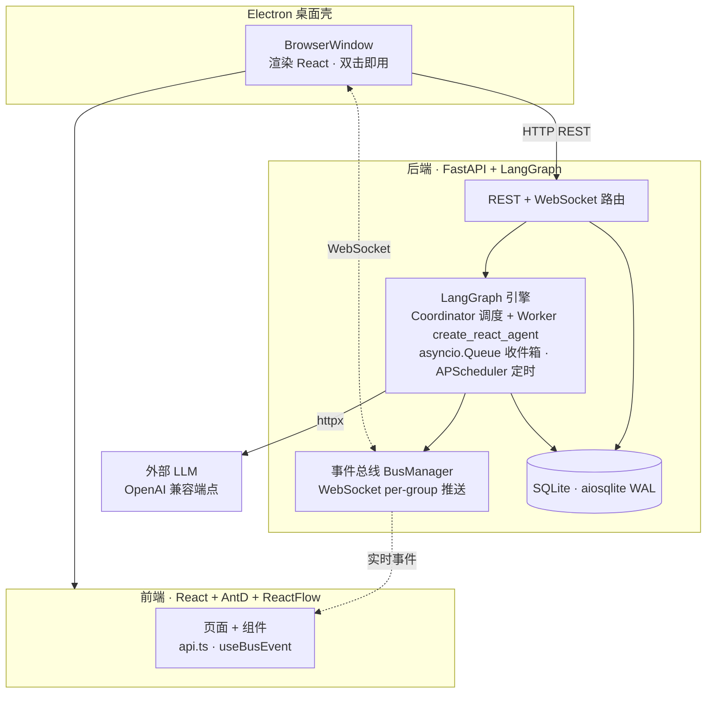
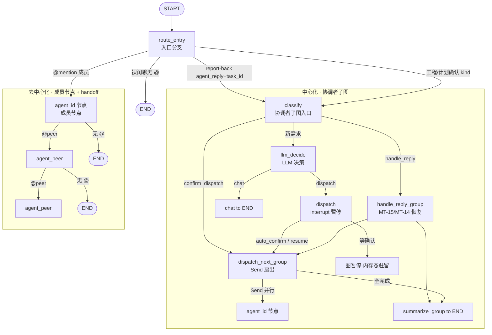
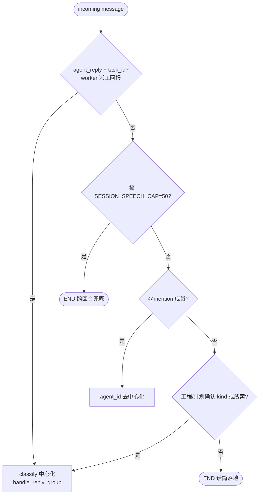
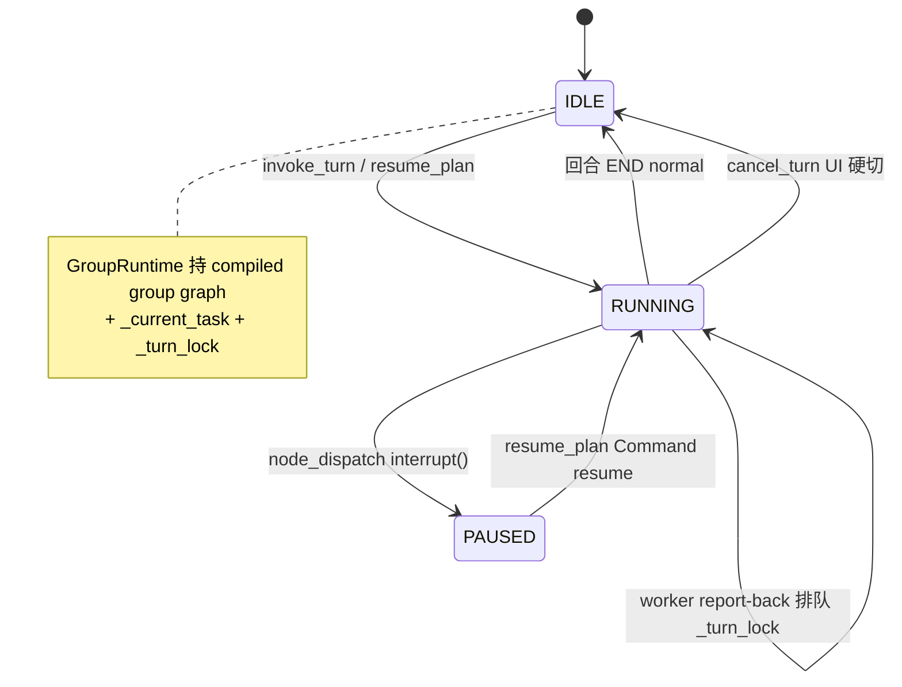
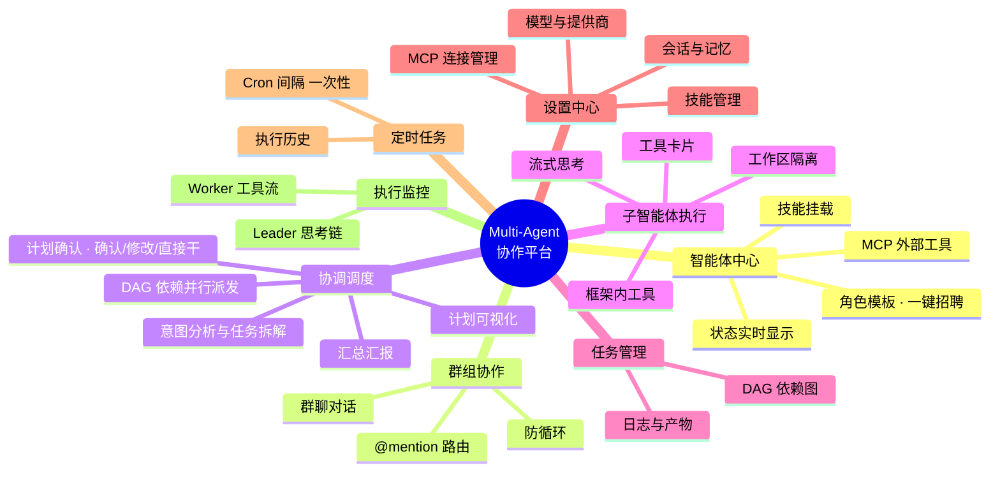
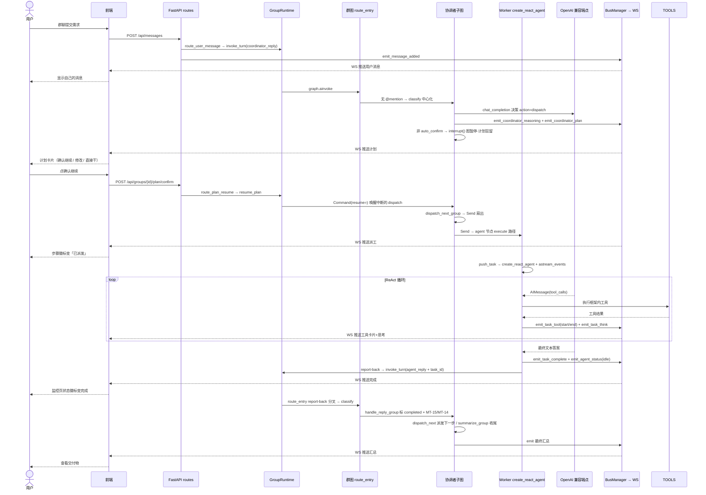

# Multi-Agent 协作桌面应用


多智能体协作桌面平台，面向通用工作场景——创建智能体、配置角色与技能，拉入群组协同完成各类任务。可承载自主规划、对话协同、团队分工、定时自动化等多种工作流，适用于运营、研究、文档、流程自动化、软件交付等领域。本项目基于 Apache License 2.0 开源。

## 项目简介

一个多智能体协作桌面应用：创建智能体、配置角色与技能，拉入群组协同完成各类工作。平台面向通用工作场景——自主规划、对话协同、团队分工、定时自动化均可，适用于运营、研究、文档、流程自动化、软件交付等领域，不限定单一行业。群主智能体负责意图分析与任务调度，子智能体在框架内自主执行具体工作。

**核心定位**：桌面端工具，双击即用，零基础设施。

**技术栈**：Electron（桌面壳）+ Python 后端（FastAPI + LangGraph + SQLAlchemy）+ React 前端（Vite + Ant Design + ReactFlow）。引擎全部基于开源框架（LangGraph `StateGraph`、`create_react_agent`、`astream_events`、APScheduler、langchain-mcp-adapters），不调外部 Claude Code CLI，不自研调度引擎。

## 整体架构图

按运行时进程分层：Electron 壳同时拉起 Python 后端与 React 前端；前端经 REST + WebSocket 与后端通信；后端 FastAPI 之下是 LangGraph 引擎层、事件总线、SQLite 持久化与工作区隔离。



### 关键链路说明

| 链路 | 走向 |
|---|---|
| 用户发消息 | React → `POST /api/messages` → `route_user_message` → `GroupRuntime.invoke_turn` 进群图 |
| 入站分叉 | `route_entry`：report-back→classify / @mention→agent 节点 / 工程需求→classify / 裸闲聊→END |
| 协调者调度 | `node_dispatch` 拆 DAG → `node_dispatch_next_group` 用 `Send` 扇出到各 agent 节点 |
| worker 执行 | agent 节点 brain 决策 `execute` → `push_task` 给自己 inbox → `create_react_agent` ReAct |
| 流式输出 | `astream_events` 的 `on_chat_model_stream` → `emit_task_token`/`emit_coordinator_token` → WS → 前端气泡逐字 |
| 计划确认 | `POST /api/groups/{id}/plan/confirm` → `GroupRuntime.resume_plan` → `Command(resume=)` 唤醒中断的 dispatch |
| 配置热切换 | `PUT /api/config` → `set_config` 写 os.environ → 引擎下次 invoke 的 `get_config()` 实时读到（CF-05） |
| 状态聚合 | `GET /api/status` → `registry.list_all_status()` 一次拉全（消除前端 N+1 轮询） |
| 定时任务 | APScheduler 触发 → 复用 `push_task` 注入 worker inbox，与人工派发同路径 |

## 群组协作图：中心化 + 去中心化同图共存

每个群组编译**一张** LangGraph `StateGraph(GroupState)`——协调者子图与成员节点 + handoff 边同图共存，共享 `GroupState`。唯一的分叉点是入口节点 `route_entry`（`engine/group_graph.py`），按消息 `incoming_kind` + 是否带 @mention 分流到两条路径。这就是「中心化调度」与「去中心化 A2A」的物理实现：不再是两套独立机制，而是同一张图里两条拓扑分支。



### 入口分叉决策（route_entry）

`route_entry` 按固定优先级判定一条入站消息走哪条路径——@mention 是显式 opt-in，优先于 kind；worker 派工回报必须走中心化收尾，否则派工步骤永远停在 dispatched（split-brain 死锁）。



### 中心化路径（协调者 owns）

`build_coordinator_subnodes`（`coordinator.py`）把协调者 7 节点打包注入群图，状态读写切到 `GroupState`（与 `CoordinatorState` 共享键，节点代码零改——都是 `state.get(...)` duck-typed 访问）：

| 节点 | 职责 | 路由 |
|---|---|---|
| `classify` | 识别入站意图（新需求/报回/确认派发） | `route_after_classify` → dispatch_next / handle_reply / llm_decide |
| `llm_decide` | LLM 决策 action（chat/dispatch/ask） | `route_after_llm_decide` → chat / dispatch |
| `dispatch` | 拆 DAG 计划 + `interrupt()` 暂停等人审 | `route_after_dispatch` → dispatch_next / END |
| `dispatch_next_group` | `Send` 并行扇出 ready 步骤到各 agent 节点 | Command(goto=Send[]) → agent 节点 |
| `handle_reply_group` | worker 报回后标 completed/failed + MT-15 失败恢复 + MT-14 步骤调整 | Command(goto=) → dispatch_next / summarize |
| `summarize_group` | 全步骤完成收尾，emit 空 plan | Command(goto=END) |
| `chat` | 回一句即 END | → END |

**派工扇出**用 LangGraph `Send` 并行 fan-out 到各 `agent_<id>` 节点（非老路径的 `push_task` 到 worker inbox），DAG fail-fast + ready_steps 逻辑（`build_dispatch_sends` 单一真源）字节级一致。`dispatch_plan` 走 `replace_value` reducer 单一真源。

### 去中心化路径（成员节点 + handoff）

每个成员一个 `agent_<id>` 节点（`worker.py:make_agent_node`，`build_agent_node` 闭包绑身份）。节点干四件事：

1. **入口守卫**——`agent_id` 已在 `recent_speakers` 则直接 END。handoff 串行只消「两节点同时跑」的抢序，但 LLM 仍可 @回已发言者形成 A→B→A→A 连发，本守卫把「同一 agent 一回合不被驱动两次」做成图内硬约束。
2. **脑回路**——`_stream_brain_decision` 流式 LLM 决策（chat/execute/ask）+ 技能注入。
3. **发言**——`_unified_reply` 持久化 + emit + 回调；execute 路径回「收到，我来…」+ `push_task` 给自己。
4. **交话筒**——`_resolve_handoff_target` 解析回复里的 @mention：首个命中 wins，跳过自己、跳过协调者（去中心化路径 worker 不 @回 Leader，Leader 只经 `route_entry` 入）；命中 → `Command(goto="agent_<peer>")`，无 → `Command(goto=END)`。

handoff 边是**动态**的（`Command.goto` 运行期从回复 @mention 决定），编译期只注册 `create_handoff_tool` 声明合法 goto 目标集，`route_entry` 校验解析到的目标是否注册（防陈旧成员列表 goto 不存在节点）。

### 三层停止兜底（Option B 后）

| 入口 | 作用域 | 机制 |
|---|---|---|
| UI 停止按钮 `cancel_turn` | 单回合硬切 | `task.cancel()` 中断 `ainvoke` |
| `AGENT_NODE_MAX_HANDOFFS=8` | 单回合 handoff 链封顶 | `route_entry`/agent 节点每跳 bump+check |
| `SESSION_SPEECH_CAP=50` | **跨回合**兜底 | `route_entry`+agent 节点入口查 `is_session_capped()`，撞顶 END；只在闲聊计，不挡派工 fan-out/report-back；`/new` reset 清零 |

软停层（`request_stop`/`is_stopped`）已删，只留硬切 + 封顶两入口。`@收束`（`converge=True`）是 UI 一次性开关 + @人，让被 @ 的 agent 回一句即 END 不 handoff，填补去中心化路径的人工收口缺口。

### GroupRuntime：群图回合控制器

`AgentRegistry` 双轨维护 `_engines`（resident per-agent 引擎，持 inbox + worker/coordinator 图）+ `_runtimes`（group→`GroupRuntime`，群图回合控制器）。生产入站走 `GroupRuntime.invoke_turn`/`resume_plan`，`_engines` 退为 resident 兜底 + execute 派工执行体。冷群/编译失败时降级 `push_notify` 走 resident 引擎（additive 兜底，不丢消息）。一个 `GroupRuntime` 用 `_turn_lock` 串行化整群回合——用户聊天、计划 resume、每个 worker 报回都打同一 runtime，并发 `ainvoke` 会撞 `turn_count`/`current_speaker` last-value 通道（`InvalidUpdateError`），锁让它们排队而非交错，对齐 resident 引擎的串行 inbox 语义。



## 功能架构图



### 功能模块与代码对照

| 功能模块 | 后端 | 前端 | 里程碑 |
|---|---|---|---|
| 智能体中心 | `api/agents.py` `models/agent.py` | `AgentPage.tsx` | M1/M2 |
| 群组协作 | `api/groups.py` `engine/mention.py` | `GroupPage.tsx` | M3/A2A |
| 协调者调度 | `engine/coordinator.py` `dispatcher.py` | `LeaderPanel.tsx` | M3/M4 |
| 计划确认 | `engine/coordinator.py` `api/plan.py` `engine/mention.py` | `PlanConfirmCard.tsx` | M12 |
| 子智能体执行 | `engine/worker.py` `agent_loop.py` `tools.py` | `WorkerTrace.tsx` | M5/M10 |
| 任务管理 | `api/tasks.py` | `TaskPage.tsx` | M4 |
| 技能系统 | `api/skills.py` `agent_executor.py` | `SkillPage.tsx` | M7 |
| MCP 工具 | `api/mcp.py` `engine/mcp_manager.py` | 配置页 | M9 |
| 定时任务 | `api/scheduled_tasks.py` `engine/scheduler.py` | 配置页 | M8 |
| 执行监控 | `events/bus.py` `api/system.py` | `MonitorPage.tsx` | M11 |
| 工作区隔离 | `engine/workspace.py` | — | M5 |
| 实时事件 | `events/bus.py` `api/websocket.py` | `useBusEvent.ts` | M5/M11 |

## 数据流：一次完整任务执行



## 核心设计决策

### 1. 两类智能体（LangGraph StateGraph）

| | 群主 Coordinator | 子智能体 Worker |
|--|------|---------|
| 实现 | `coordinator.py` 的 `StateGraph`（7 节点 + conditional edge） | `worker.py` 的 `StateGraph`（brain 决策）+ `agent_loop.py` 的 `create_react_agent` |
| 职责 | 意图分析、任务拆解、DAG 调度、汇总 | 执行具体工作（随场景而异：开发/编译/测试、文档撰写、数据处理等） |
| 运行形态 | 主进程内常驻 `asyncio.Task` | `create_react_agent` 框架内 ReAct 循环 |
| 框架能力 | LangGraph `StateGraph` + `MemorySaver` checkpointer + `thread_id` | `langgraph.prebuilt.create_react_agent` + `astream_events(version="v2")` |

### 2. 编排用 LangGraph 原生术语

协调与执行**不使用自创比喻**，全部用 LangGraph 原生概念：
- **StateGraph**：coordinator / worker 各一张图，节点（node）间用 conditional edge 路由（`route_after_classify`）。
- **checkpointer + thread_id**：`MemorySaver` 保存图内状态，`thread_id = "{group_id}:{agent_id}"` 跨轮次保持上下文。
- **create_react_agent + astream_events**：worker 的 ReAct 循环由 `langgraph.prebuilt.create_react_agent` 构建（选它而非 `create_agent`，是因为后者非流式，无法满足 PL-08 逐字流式），我们只订阅 `astream_events` 事件流（`on_tool_start`/`on_tool_end`/`on_chain_end`/`on_chat_model_stream`），投影成 typed `BusEventData`。
- **asyncio.Queue channel**：agent 间不点对点直连，通过 `inbox.py` 的 `asyncio.Queue` 解耦——`push_task`/`push_notify` 投递，引擎 `await get()` 阻塞唤醒（零空转、真消息驱动）。

### 3. 引擎不自研，全部用开源框架

| 能力 | 开源框架 | 代码 |
|---|---|---|
| Agent 编排 | LangGraph `StateGraph` | `engine/coordinator.py` `engine/worker.py` |
| ReAct 循环 | `langgraph.prebuilt.create_react_agent` | `engine/agent_loop.py` |
| 事件流 | `astream_events(version="v2")` | `engine/agent_loop.py` |
| 外部工具协议 | `langchain-mcp-adapters` → `BaseTool` | `engine/mcp_manager.py` |
| 定时调度 | APScheduler（`AsyncIOScheduler`） | `engine/scheduler.py` |
| 框架内工具 | `langchain_core.tools.@tool` | `engine/tools.py` |

### 4. 工作区隔离

每个群组一个独立工作目录 `DATA_DIR/workspaces/{group_id}/`，`safe_path()` 做路径穿越防护。worker 的框架内工具（read_file/write_file/edit_file/list_dir/run_command）通过闭包绑定到该目录，不同群组互不干扰。

### 5. SQLite + WAL 持久化

单机桌面应用，数据用 SQLAlchemy async + aiosqlite（WAL 模式）。五实体（agents/groups/members/tasks/messages）+ 技能/MCP/定时任务。实时事件用 WebSocket 总线（`BusManager` 按 group 分组 fan-out），无需查询优化与跨进程通信。

### 6. DAG 依赖感知调度

无依赖的任务并行派发（M4 fan-out），有依赖的等前置完成后再派发。Coordinator 的 `dispatch_next` 节点找出所有 deps 满足的 pending 步骤，一次性 fan-out 到各自 worker 引擎。

### 7. 两条协作路径 + @mention 防循环

群组协作有**两条互补路径**，按任务形态分流、互不干涉——二者共存于同一张群图（见上节《群组协作图》），`route_entry` 按消息 kind + @mention 分叉：

| | 中心化调度 | 去中心化 A2A |
|--|------|------|
| 适用 | 有明确步骤、可并行/依赖的工程任务（写代码、调研、交付物） | 来回互动型任务（成语接龙、你画我猜、多轮讨论、对话游戏） |
| 入口 | 裸工程需求 / `coordinator_reply` kind → `classify` → `dispatch` 拆 DAG | @成员 → `agent_<id>` 节点发言 |
| 传递 | `dispatch_next_group` 用 `Send` 扇出到各 agent 节点（DAG fail-fast + ready_steps） | `make_agent_node` 脑回路→发言→`Command(goto="agent_<peer>")` handoff |
| 终止 | 全步骤完成 → `summarize_group` 汇总 | 成员接不上不再 @对方，话筒自然落地 END |

派工扇出不解析 @mention，A2A handoff 不进 create_react_agent——互动型来回对话不会被塞进带工具的 ReAct 重路径。协调者在去中心化路径上不被触达（worker 不 @回 Leader），彻底消除「协调者每轮插话」老毛病。

**handoff 防连发/防死循环**（去中心化路径，图内三层约束）：
- **图内防连发守卫**：`make_agent_node` 入口查 `recent_speakers`，`agent_id` 已在本回合发过言则直接 END——handoff 串行只消「两节点同时跑」的抢序，但 LLM 仍可 @回已发言者形成 A→B→A→A 连发，本守卫兜底。
- **handoff 链封顶**：`AGENT_NODE_MAX_HANDOFFS=8` 限单回合 handoff 链长度（`route_entry`/agent 节点每跳 bump+check），防 LLM 失灵无限 handoff。
- **跨回合封顶**：`SESSION_SPEECH_CAP=50` 跨回合累加（接龙是多个短回合），撞顶 END，`/new` reset 清零。只在闲聊计，不挡派工 fan-out/report-back。

### 8. 计划确认闭环（PL-02/PL-03）

协调者拆解出协作计划后**默认不立即派发**——`node_dispatch` 广播计划后 `interrupt()` 暂停图，计划驻留 checkpointer 内存态（`dispatch_plan` 走 `replace_value` reducer 单一真源），等用户确认后 `resume_plan` 发 `Command(resume=<payload>)` 唤醒同 thread 继续，把「人审」补进自主规划流程：

- **确认继续**：`POST /api/groups/{id}/plan/confirm` → `route_plan_resume` → `GroupRuntime.resume_plan` → `Command(resume=)` 唤醒中断的 dispatch → `dispatch_next_group` 扇出。
- **直接干**：`POST /api/groups/{id}/plan/direct` → 置 `group.config.auto_confirm=True`，本群后续计划 `node_dispatch` 跳过 `interrupt()` 直接扇出。
- **修改**：`POST /api/groups/{id}/plan/modify` → patch 步骤指令/依赖后被改步复位 pending + 重广播 + 确认派发。

前端 `PlanConfirmCard`（插在消息流顶部）展示步骤 + 状态徽标 + 三动作按钮。双模渲染：有 pending 步骤 → 确认模式（Alert + 三按钮）；直接干飞行中（无 pending 未全完成）→ 只读进度模式（步骤徽标随 `coordinator_plan` 事件实时翻色，`node_handle_reply_group` 推进状态后 emit 推前端）。

> 关键约束：非 dispatch 动作（chat/ask/continue）**不回写** `dispatch_plan`——否则 `replace_value` reducer 会用空 `[]` 抹掉驻留计划，确认卡片凭空消失。`node_llm_decide` 只在 `action=dispatch` 时返回该 key，LangGraph 不跑 reducer 即保留驻留态。

## 技术栈

| 层 | 技术 |
|----|------|
| 桌面壳 | Electron 33（main process 拉起 Python + 渲染 React） |
| 前端 | React 19 + Vite 8 + Ant Design 6 + ReactFlow |
| 后端框架 | Python 3 + FastAPI + uvicorn |
| Agent 编排 | LangGraph 1.2（StateGraph + MemorySaver + checkpointer） |
| ReAct 循环 | LangGraph `create_react_agent` + `astream_events` |
| LLM 客户端 | OpenAI 兼容 HTTP（httpx，DeepSeek/OpenAI 等端点） |
| 外部工具协议 | langchain-mcp-adapters |
| 定时任务 | APScheduler（AsyncIOScheduler + Cron/Interval/Date Trigger） |
| 持久化 | SQLAlchemy async + aiosqlite（WAL 模式） |
| 实时事件 | WebSocket 总线（`BusManager` per-group fan-out） |
| 进程间通信 | Electron ↔ Python：HTTP REST + WebSocket |
| 跨平台 | macOS / Windows / Linux（electron-builder） |

## 默认角色模板

内置可「一键招聘」的角色模板（`backend/agent_templates.py`），随版本持续扩充：

| 角色 | 职责 |
|------|------|
| 后端开发工程师 | API、数据层与服务端业务逻辑（Python/FastAPI、SQL） |
| 前端开发工程师 | 页面与组件开发（React、TypeScript、CSS） |
| 全栈工程师 | 贯通前后端，端到端交付功能 |
| 测试工程师 | 测试用例设计、边界覆盖、回归守护 |
| DevOps 工程师 | 部署、CI/CD、基础设施 |
| 产品经理 | 需求分析、用户故事、优先级排序 |
| 数据分析师 | 数据清洗、SQL 查询、报表生成 |
| UI/UX 设计师 | 视觉设计、交互设计、设计系统 |
| 技术文档工程师 | 技术文档撰写、API 文档、与代码同源 |
| 安全工程师 | 安全审查、漏洞评估、风险处置 |

> 模板只是预设起点，用户可自定义任意角色与 system prompt，适配各类工作场景（运营、研究、文档、流程自动化、软件交付等）。

## 快速开始

```bash
# 安装依赖
npm install
pip install -r backend/requirements.txt

# 开发模式（同时启动 Python 后端 + Vite 前端 + Electron 壳）
npm run dev

# 仅前端（调试 UI，需后端已起）
npm run dev:web

# 打包桌面应用（前端构建 + PyInstaller 后端 + electron-builder）
npm run pack          # 当前平台
npm run pack:linux    # 指定平台
```

开发前需配置 LLM 环境变量。在项目根创建 `.env` 文件（`main.py` 启动时自动加载）：

```bash
# .env（dotenvy 自动加载，无需手动 source）
OPENAI_API_KEY=sk-...
OPENAI_BASE_URL=https://api.deepseek.com/v1   # 或 OpenAI / 其他兼容端点
LLM_MODEL=deepseek-v4-flash                    # 可选
```

## 环境要求

- Node.js 20+
- Python 3.10+（含 `pip`）
- Electron 系统依赖（Linux：`libgtk-3-0 libnss3 libasound2` 等）
- LLM API 密钥（OpenAI / DeepSeek / 其他兼容端点，通过 `.env` 注入）

## 项目结构

```
multi-Agent/
  electron/                      # Electron 桌面壳
    main.ts                     # 主进程：拉起 Python + 创建 BrowserWindow
  backend/                      # Python 后端（FastAPI + LangGraph）
    main.py                     # FastAPI 入口：lifespan → init_db → registry → scheduler
    config.py                   # .env 加载（OPENAI_API_KEY/BASE_URL/LLM_MODEL）
    api/                        # REST + WebSocket 路由
      agents.py groups.py tasks.py messages.py
      skills.py mcp.py scheduled_tasks.py system.py websocket.py
    engine/                     # LangGraph 引擎层
      registry.py              # AgentRegistry 双轨 _engines + _runtimes
      group_runtime.py          # GroupRuntime 群图回合控制器（invoke_turn/resume_plan/cancel_turn）
      group_graph.py            # per-group swarm StateGraph（route_entry 分叉 + 协调者子图 + agent 节点 + handoff 边）
      coordinator.py           # 协调者子图节点（classify/llm_decide/dispatch/handle_reply_group/...）
      worker.py                # 成员节点 make_agent_node + worker StateGraph（brain 决策）
      agent_loop.py            # create_react_agent + astream_events（ReAct 循环）
      agent_executor.py        # 桥接：技能注入 + MCP 注入 → run_agent_loop
      tools.py                 # @tool 框架内工具（read_file/write_file/...）
      mcp_manager.py           # langchain-mcp-adapters → BaseTool
      inbox.py                 # asyncio.Queue channel（push_task/push_notify 唤醒）
      dispatcher.py             # DAG fan-out（dispatch_ready_steps / build_dispatch_sends 单一真源）
      mention.py                # route_user_message（入站→GroupRuntime）+ @mention 解析
      workspace.py             # 工作区隔离 + safe_path
      scheduler.py             # APScheduler 定时触发
    llm/                       # OpenAI 兼容 HTTP + 提示词 + JSON 提取
    models/                    # Pydantic 数据模型（agent/group/task/message/skill/mcp/scheduled_task）
    store/                     # SQLAlchemy async + aiosqlite + CRUD + seed
    events/                    # bus.py BusManager + typed emit helpers
  src/                          # 前端 Renderer（React）
    pages/                      # AgentPage · GroupPage · TaskPage · MonitorPage · SkillPage
    components/                 # LeaderPanel · WorkerTrace · LogPanel · AgentAvatar · Layout
    services/api.ts            # REST fetch + WebSocket onBusEvent
    hooks/useBusEvent.ts        # logs / events / agentStatuses / plan
```

> 运行时数据目录：`MULTI_AGENT_DATA_DIR` 环境变量指定（Electron 托管时设为 `app.getPath('userData')`），含 SQLite 数据库 + `workspaces/{group_id}/` 工作目录 + `logs/`。

## 路线图

- [x] Electron + Python(FastAPI+LangGraph) 后端推倒重来（M1/M2/M3）
- [x] LangGraph coordinator + worker 双 StateGraph + create_react_agent ReAct 循环（M3/M5/M10）
- [x] DAG 并行派发 + 任务管理（M4）
- [x] 技能系统（内置 + LLM 生成 + 挂载注入，M7）
- [x] MCP 外部工具集成（langchain-mcp-adapters，M9）
- [x] 定时任务（APScheduler + 复用 push_task + 执行历史，M8）
- [x] 黑盒透明化 UI（typed BusEventData + LeaderPanel + WorkerTrace 监控，M11）
- [x] 计划确认闭环（PL-02 确认/修改 + PL-03 直接干，interrupt 内存态驻留 + resume_plan Command 唤醒）
- [x] Apache License 2.0 开源协议
- [x] 去中心化 A2A 协作路径（per-group swarm 群图：route_entry 分叉 + 成员节点 handoff + 图内防连发守卫）
- [x] 单图双路径：中心化协调者子图 + 去中心化成员 handoff 同图共存，共享 GroupState
- [x] 透明化统计：协调者/worker 回复均带「model · Ns · ↓ N tokens（含 N 推理）」状态行（流式采集真实 usage）
- [x] 对话语音朗读（Web Speech API，自动朗读 + 气泡按需朗读）
- [x] 顶部栏三视图切换（对话 / 智能体广场 / skill广场）+ 用户入口移至侧栏左下角
- [ ] 执行可控：停止执行 / 超时降级 / 失败重派
- [ ] 产物交付：交付物下载 / 文件浏览
- [ ] 协调者主动收尾：监听群消息判断 A2A 何时该停（替换硬轮次上限的最终停止机制）
- [ ] 打包发布（PyInstaller + electron-builder）

## License

本项目基于 [Apache License 2.0](./LICENSE) 开源。
