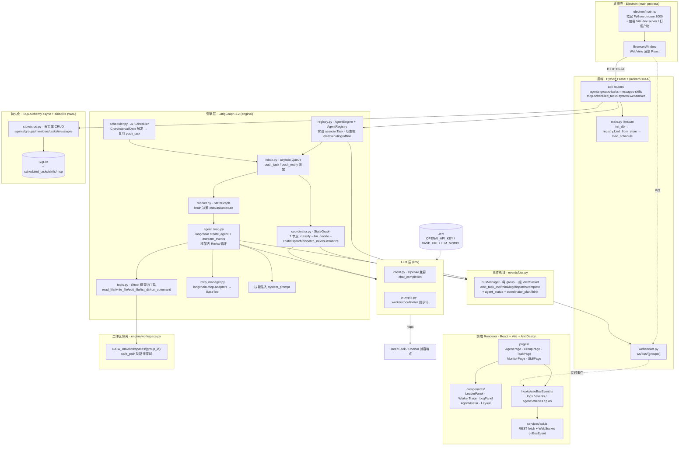
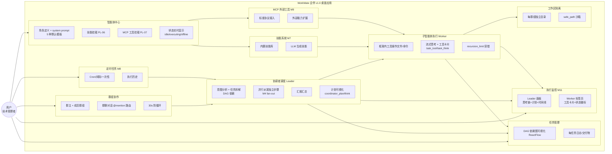

# Multi-Agent 协作桌面应用


多智能体协作框架，解决软件工程虚拟交付问题。本项目基于 Apache License 2.0 开源。

## 项目简介

一个多智能体协作桌面应用：创建智能体、配置角色与技能，拉入群组协作完成软件交付任务。群主智能体负责意图分析与任务调度，子智能体在框架内自主执行开发、编译、测试等具体工作。

**核心定位**：桌面端工具，双击即用，零基础设施。

**技术栈**：Electron（桌面壳）+ Python 后端（FastAPI + LangGraph + SQLAlchemy）+ React 前端（Vite + Ant Design + ReactFlow）。引擎全部基于开源框架（LangGraph `StateGraph`、`create_agent`、`astream_events`、APScheduler、langchain-mcp-adapters），不调外部 Claude Code CLI，不自研调度引擎——招投标技术背书。

## 整体架构图



## 功能架构图



### 功能模块与代码对照

| 功能模块 | 后端 | 前端 | 里程碑 |
|---|---|---|---|
| 智能体中心 | `api/agents.py` `models/agent.py` | `AgentPage.tsx` | M1/M2 |
| 群组协作 | `api/groups.py` `engine/mention.py` | `GroupPage.tsx` | M3 |
| 协调者调度 | `engine/coordinator.py` `dispatcher.py` | `LeaderPanel.tsx` | M3/M4 |
| 子智能体执行 | `engine/worker.py` `agent_loop.py` `tools.py` | `WorkerTrace.tsx` | M5/M10 |
| 任务管理 | `api/tasks.py` | `TaskPage.tsx` | M4 |
| 技能系统 | `api/skills.py` `agent_executor.py` | `SkillPage.tsx` | M7 |
| MCP 工具 | `api/mcp.py` `engine/mcp_manager.py` | 配置页 | M9 |
| 定时任务 | `api/scheduled_tasks.py` `engine/scheduler.py` | 配置页 | M8 |
| 执行监控 | `events/bus.py` `api/system.py` | `MonitorPage.tsx` | M11 |
| 工作区隔离 | `engine/workspace.py` | — | M5 |
| 实时事件 | `events/bus.py` `api/websocket.py` | `useBusEvent.ts` | M5/M11 |

## 数据流：一次完整任务执行

```mermaid
sequenceDiagram
    actor U as 用户
    participant F as 前端
    participant API as FastAPI routes
    participant REG as AgentRegistry
    participant CO as Coordinator StateGraph
    participant LOOP as Worker create_agent
    participant LLM as OpenAI 兼容端点
    participant BUS as BusManager → WS

    U->>F: 群聊提交需求
    F->>API: POST /api/messages
    API->>REG: push_notify → coordinator
    API->>BUS: emit_message_added
    BUS-->>F: WS 推送用户消息
    F-->>U: 显示自己的消息

    REG-->>CO: asyncio.Queue 唤醒
    CO->>LLM: chat_completion 决策 action=dispatch
    CO->>BUS: emit_coordinator_think + emit_coordinator_plan
    CO->>REG: push_task → 第一个 worker
    BUS-->>F: WS 推送计划+派工
    F-->>U: 看到协作计划

    REG-->>LOOP: asyncio.Queue 唤醒 worker
    LOOP->>LLM: create_agent + astream_events
    loop ReAct 循环
        LLM-->>LOOP: AIMessage(tool_calls)
        LOOP->>TOOLS: 执行框架内工具
        TOOLS-->>LOOP: 工具结果
        LOOP->>BUS: emit_task_tool(start/end) + emit_task_think
        BUS-->>F: WS 推送工具卡片+思考
    end
    LLM-->>LOOP: 最终文本答案
    LOOP->>BUS: emit_task_complete + emit_agent_status(idle)
    LOOP->>CO: push_notify 汇报
    BUS-->>F: WS 推送完成
    F-->>U: 监控页状态徽标变完成

    CO->>CO: action=continue 派发下一步 / summarize 汇总
    CO->>BUS: emit 最终汇总
    BUS-->>F: WS 推送汇总
    F-->>U: 查看交付物
```

## 核心设计决策

### 1. 两类智能体（LangGraph StateGraph）

| | 群主 Coordinator | 子智能体 Worker |
|--|------|---------|
| 实现 | `coordinator.py` 的 `StateGraph`（7 节点 + conditional edge） | `worker.py` 的 `StateGraph`（brain 决策）+ `agent_loop.py` 的 `create_agent` |
| 职责 | 意图分析、任务拆解、DAG 调度、汇总 | 开发、编译、测试 |
| 运行形态 | 主进程内常驻 `asyncio.Task` | `create_agent` 框架内 ReAct 循环 |
| 框架背书 | LangGraph `StateGraph` + `MemorySaver` checkpointer + `thread_id` | `langchain.agents.create_agent` + `astream_events(version="v2")` |

### 2. 编排用 LangGraph 原生术语

协调与执行**不使用自创比喻**，全部用 LangGraph 原生概念：
- **StateGraph**：coordinator / worker 各一张图，节点（node）间用 conditional edge 路由（`route_after_classify`）。
- **checkpointer + thread_id**：`MemorySaver` 保存图内状态，`thread_id = "{group_id}:{agent_id}"` 跨轮次保持上下文。
- **create_agent + astream_events**：worker 的 ReAct 循环由框架 `create_agent` 构建，我们只订阅 `astream_events` 事件流（`on_tool_start`/`on_tool_end`/`on_chain_end`），投影成 typed `BusEventData`。
- **asyncio.Queue channel**：agent 间不点对点直连，通过 `inbox.py` 的 `asyncio.Queue` 解耦——`push_task`/`push_notify` 投递，引擎 `await get()` 阻塞唤醒（零空转、真消息驱动）。

### 3. 引擎不自研，全部用开源框架

| 能力 | 开源框架 | 代码 |
|---|---|---|
| Agent 编排 | LangGraph `StateGraph` | `engine/coordinator.py` `engine/worker.py` |
| ReAct 循环 | `langchain.agents.create_agent` | `engine/agent_loop.py` |
| 事件流 | `astream_events(version="v2")` | `engine/agent_loop.py` |
| 外部工具协议 | `langchain-mcp-adapters` → `BaseTool` | `engine/mcp_manager.py` |
| 定时调度 | APScheduler（`AsyncIOScheduler`） | `engine/scheduler.py` |
| 框架内工具 | `langchain_core.tools.@tool` | `engine/tools.py` |

### 4. 工作区隔离

每个群组一个独立工作目录 `DATA_DIR/workspaces/{group_id}/`，`safe_path()` 做路径穿越防护。worker 的框架内工具（read_file/write_file/edit_file/list_dir/run_command）通过闭包绑定到该目录，不同群组互不干扰。`Workspace` trait 预留 Docker/E2B 接缝。

### 5. SQLite + WAL 持久化

单机桌面应用，数据用 SQLAlchemy async + aiosqlite（WAL 模式）。五实体（agents/groups/members/tasks/messages）+ 技能/MCP/定时任务。实时事件用 WebSocket 总线（`BusManager` 按 group 分组 fan-out），无需查询优化与跨进程通信。

### 6. DAG 依赖感知调度

无依赖的任务并行派发（M4 fan-out），有依赖的等前置完成后再派发。Coordinator 的 `dispatch_next` 节点找出所有 deps 满足的 pending 步骤，一次性 fan-out 到各自 worker 引擎。

### 7. @mention 智能路由 + 防循环

群聊消息中的 @mention 自动路由到对应智能体。30 秒防循环机制，避免两个智能体互相 @ 死循环。

## 技术栈

| 层 | 技术 |
|----|------|
| 桌面壳 | Electron 33（main process 拉起 Python + 渲染 React） |
| 前端 | React 19 + Vite 8 + Ant Design 6 + ReactFlow |
| 后端框架 | Python 3 + FastAPI + uvicorn |
| Agent 编排 | LangGraph 1.2（StateGraph + MemorySaver + checkpointer） |
| ReAct 循环 | langchain `create_agent` + `astream_events` |
| LLM 客户端 | OpenAI 兼容 HTTP（httpx，DeepSeek/OpenAI 等端点） |
| 外部工具协议 | langchain-mcp-adapters |
| 定时任务 | APScheduler（AsyncIOScheduler + Cron/Interval/Date Trigger） |
| 持久化 | SQLAlchemy async + aiosqlite（WAL 模式） |
| 实时事件 | WebSocket 总线（`BusManager` per-group fan-out） |
| 进程间通信 | Electron ↔ Python：HTTP REST + WebSocket |
| 跨平台 | macOS / Windows / Linux（electron-builder） |

## 默认角色模板

| 角色 | 职责 |
|------|------|
| 前端工程师 | 页面开发、组件实现（React/Vue, CSS, Jest） |
| 后端工程师 | API 开发、数据库操作（Python/FastAPI, SQL） |
| 测试工程师 | 测试用例、执行测试（pytest, 缺陷跟踪） |
| 代码审查员 | 代码质量、安全审查 |
| DevOps 工程师 | 部署、CI/CD（Docker, 部署脚本） |

## 快速开始

```bash
# 安装依赖
npm install
pip install -r backend/requirements.txt

# 开发模式（同时启动 Python 后端 + Vite 前端 + Electron 壳）
npm run dev

# 仅前端（调试 UI，需后端已起）
npm run dev:web

# 打包桌面应用（前端构建 + PyInstaller 后端 + electron-builder）
npm run pack          # 当前平台
npm run pack:linux    # 指定平台
```

开发前需配置 LLM 环境变量。在项目根创建 `.env` 文件（`main.py` 启动时自动加载）：

```bash
# .env（dotenvy 自动加载，无需手动 source）
OPENAI_API_KEY=sk-...
OPENAI_BASE_URL=https://api.deepseek.com/v1   # 或 OpenAI / 其他兼容端点
LLM_MODEL=deepseek-v4-flash                    # 可选
```

## 环境要求

- Node.js 20+
- Python 3.10+（含 `pip`）
- Electron 系统依赖（Linux：`libgtk-3-0 libnss3 libasound2` 等）
- LLM API 密钥（OpenAI / DeepSeek / 其他兼容端点，通过 `.env` 注入）

## 项目结构

```
multi-Agent/
  electron/                      # Electron 桌面壳
    main.ts                     # 主进程：拉起 Python + 创建 BrowserWindow
  backend/                      # Python 后端（FastAPI + LangGraph）
    main.py                     # FastAPI 入口：lifespan → init_db → registry → scheduler
    config.py                   # .env 加载（OPENAI_API_KEY/BASE_URL/LLM_MODEL）
    api/                        # REST + WebSocket 路由
      agents.py groups.py tasks.py messages.py
      skills.py mcp.py scheduled_tasks.py system.py websocket.py
    engine/                     # LangGraph 引擎层
      registry.py              # AgentEngine + AgentRegistry（常驻 asyncio.Task）
      coordinator.py           # 协调者 StateGraph（7 节点 + conditional edge）
      worker.py                # Worker StateGraph（brain 决策）
      agent_loop.py            # create_agent + astream_events（ReAct 循环）
      agent_executor.py        # 桥接：技能注入 + MCP 注入 → run_agent_loop
      tools.py                 # @tool 框架内工具（read_file/write_file/...）
      mcp_manager.py           # langchain-mcp-adapters → BaseTool
      inbox.py                 # asyncio.Queue channel（push_task/push_notify 唤醒）
      dispatcher.py             # DAG fan-out 派发
      mention.py                # @mention 路由 + 防循环
      workspace.py             # 工作区隔离 + safe_path
      scheduler.py             # APScheduler 定时触发
    llm/                       # OpenAI 兼容 HTTP + 提示词 + JSON 提取
    models/                    # Pydantic 数据模型（agent/group/task/message/skill/mcp/scheduled_task）
    store/                     # SQLAlchemy async + aiosqlite + CRUD + seed
    events/                    # bus.py BusManager + typed emit helpers
  src/                          # 前端 Renderer（React）
    pages/                      # AgentPage · GroupPage · TaskPage · MonitorPage · SkillPage
    components/                 # LeaderPanel · WorkerTrace · LogPanel · AgentAvatar · Layout
    services/api.ts            # REST fetch + WebSocket onBusEvent
    hooks/useBusEvent.ts        # logs / events / agentStatuses / plan
```

> 运行时数据目录：`MULTI_AGENT_DATA_DIR` 环境变量指定（Electron 托管时设为 `app.getPath('userData')`），含 SQLite 数据库 + `workspaces/{group_id}/` 工作目录 + `logs/`。

## 路线图

- [x] Electron + Python(FastAPI+LangGraph) 后端推倒重来（M1/M2/M3）
- [x] LangGraph coordinator + worker 双 StateGraph + create_agent ReAct 循环（M3/M5/M10）
- [x] DAG 并行派发 + 任务管理（M4）
- [x] 技能系统（内置 + LLM 生成 + 挂载注入，M7）
- [x] MCP 外部工具集成（langchain-mcp-adapters，M9）
- [x] 定时任务（APScheduler + 复用 push_task + 执行历史，M8）
- [x] 黑盒透明化 UI（typed BusEventData + LeaderPanel + WorkerTrace 监控，M11）
- [x] Apache License 2.0 开源协议
- [ ] 执行可控：停止执行 / 超时降级 / 失败重派
- [ ] 产物交付：交付物下载 / 文件浏览
- [ ] 计划确认：用户确认协作计划后执行
- [ ] 打包发布（PyInstaller + electron-builder）

## License

本项目基于 [Apache License 2.0](./LICENSE) 开源。
