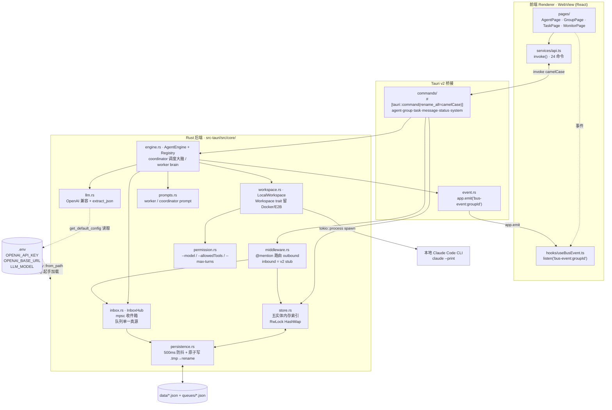
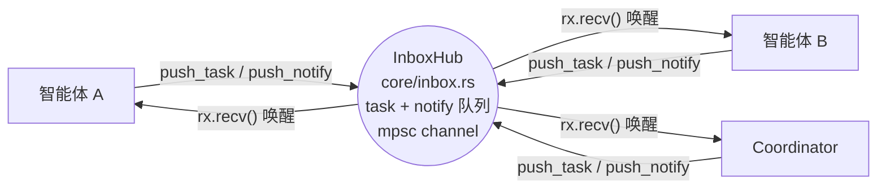
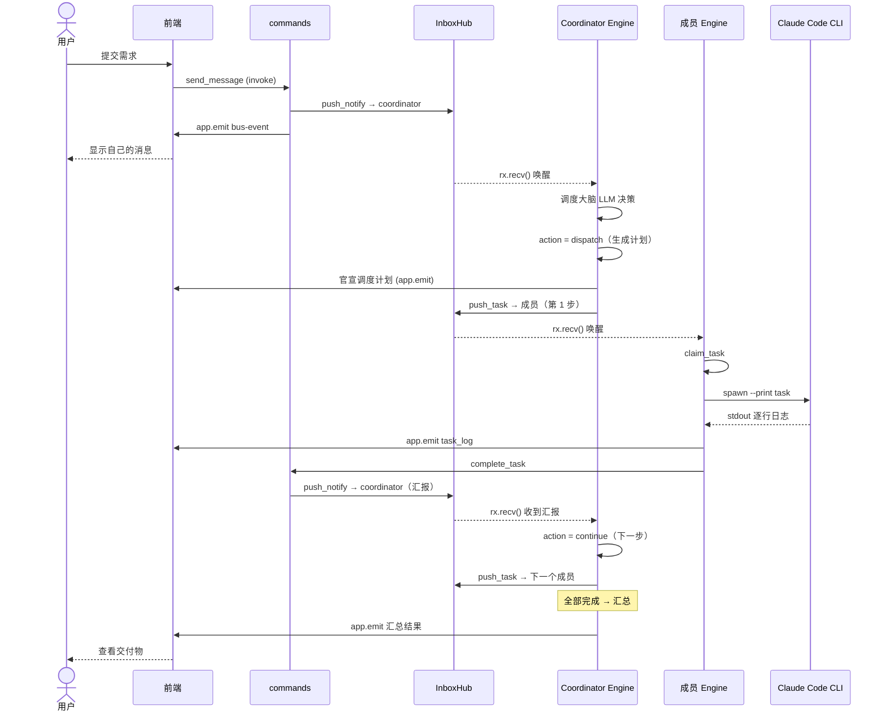
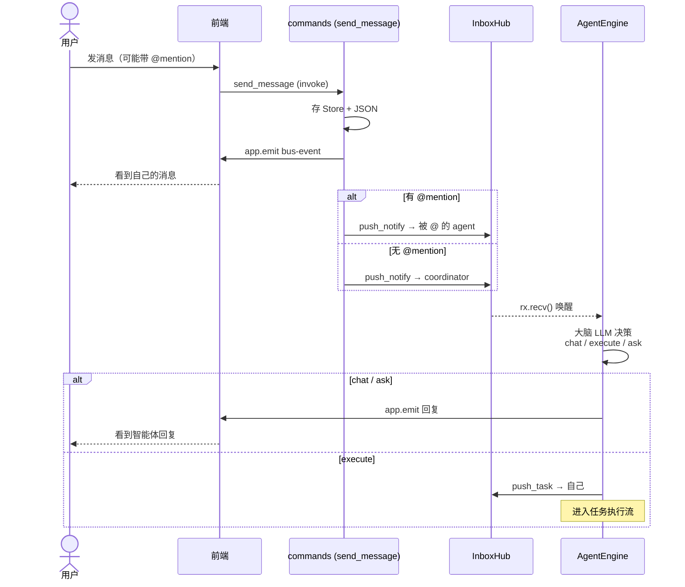
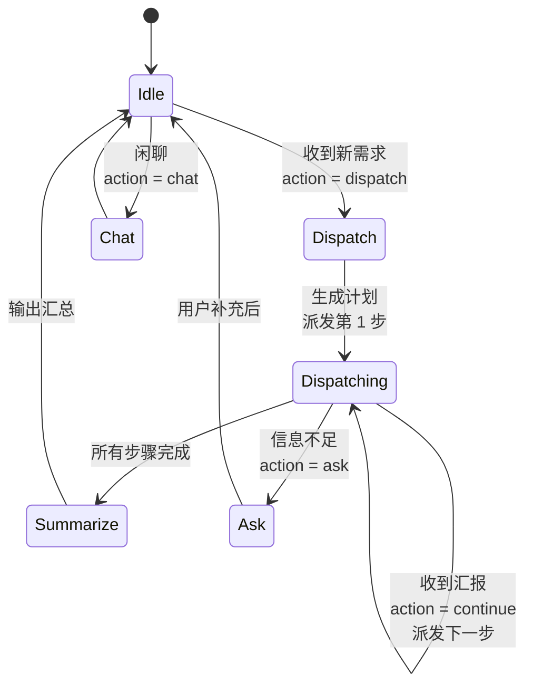
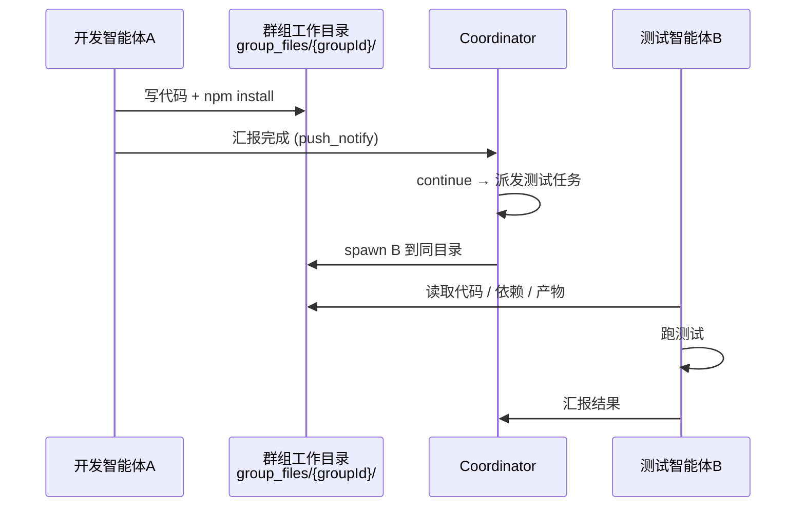

# Multi-Agent 协作桌面应用

多智能体协作框架，解决软件工程虚拟交付问题。

## 项目简介

一个多智能体协作桌面应用：创建智能体、配置角色与技能，拉入群组协作完成软件交付任务。群主智能体负责意图分析与任务调度，子智能体通过本地 Claude Code CLI 执行开发、编译、测试等具体工作。

**核心定位**：桌面端工具，双击即用，零基础设施。

> 后端已用 **Rust + Tauri v2** 重写，A2A 引擎基于 **tokio mpsc** 真消息驱动（替代轮询）。前端保留 React + Ant Design + ReactFlow。

## 整体架构图



## A2A 通信：InboxHub「扔字条」

智能体之间**不点对点直连**，而是通过收件箱中心解耦通信——任何 agent 向中心「扔字条」（任务 / 通知），接收者通过 tokio mpsc channel 被唤醒取信，互不知道对方是否存在。



> 核心改造：TS 版用 `setInterval` 100ms 轮询收件箱；Rust 版改为每 (group, agent) 一个 mpsc channel，`push_*` 直接 `tx.send()` 唤醒目标引擎，引擎 `rx.recv().await` 阻塞等待——**零空转、真消息驱动**。队列在 `inbox.rs` 单一真源（旧代码 Store.queues 与 SharedStateCenter 双拷贝已消除）。

## 数据流图

### 完整任务执行流程



### 群聊消息流



### Coordinator 调度状态机



### 智能体间文件交换



## 核心设计决策

### 1. 两类智能体

|  | 群主 Coordinator | 子智能体 |
|--|------|---------|
| 本质 | LLM API 直调 + 调度大脑 | Claude Code CLI 进程 |
| 职责 | 意图分析、任务拆解、DAG 调度 | 开发、编译、测试 |
| 运行位置 | tokio task（主进程内） | `tokio::process::spawn` |
| 成本 | 低 | 中 |

### 2. 本地进程替代容器

子智能体都是 Claude Code CLI 实例，只需不同的 system prompt 和工作目录。本地进程启动更快，同一群组共享工作目录，天然支持文件交换和依赖复用。

### 3. A2A 收件箱中心（扔字条）

智能体间通信全部走 `InboxHub`（`core/inbox.rs`），禁止点对点直接调用。父/子 agent 真正成为独立任务实体，通过写/读中间队列通信。队列在 inbox.rs 单一真源（旧代码 Store.queues + SharedStateCenter 双拷贝已消除）。

### 4. 内存 + JSON 文件存储

单机桌面应用，数据全在内存，持久化用 JSON 文件（防抖 + 原子写）。事件用 Tauri `app.emit` / `listen`，无需查询优化、事务、跨进程通信。

### 5. DAG 依赖感知调度

无依赖的任务并行派发，有依赖的等前置完成后再派发。Coordinator 调度大脑按步骤依赖推进下游。

### 6. @mention 智能路由

群聊消息中的 @mention 自动扔字条到对应智能体收件箱。30 秒防循环机制，避免两个智能体互相 @ 死循环。

## 技术栈

| 层 | 技术 |
|----|------|
| 桌面框架 | Tauri v2（Rust） |
| 前端 | React + Vite + Ant Design + ReactFlow |
| 后端 | Rust（tokio async runtime） |
| 群主调度 | tokio task + mpsc channel 消息驱动 |
| 群主 LLM | OpenAI 兼容 HTTP API 直调（reqwest） |
| 子智能体运行时 | 本地 Claude Code CLI（`tokio::process::Command`） |
| 数据存储 | 内存 + JSON 文件（防抖 + 原子写） |
| A2A 通信 | InboxHub（core/inbox.rs）+ tokio mpsc 收件箱 |
| 实时事件 | Tauri `app.emit` / `listen` |
| 进程间通信 | Tauri `invoke` / `#[command]` |
| 跨平台 | macOS / Windows / Linux（tauri bundler） |

## 默认角色模板

| 角色 | 职责 | 技能（自动映射） |
|------|------|---------|
| 前端工程师 | 页面开发、组件实现 | React/Vue, CSS/Tailwind, Jest/Vitest |
| 后端工程师 | API 开发、数据库操作 | Python/FastAPI, SQL, API 设计 |
| 测试工程师 | 测试用例、执行测试 | 测试用例设计, pytest, 缺陷跟踪 |
| 代码审查员 | 代码质量、安全审查 | 代码审查, 安全检查, 架构评估 |
| DevOps 工程师 | 部署、CI/CD | Docker, CI/CD, 部署脚本 |

## 快速开始

```bash
# 安装依赖
npm install

# 开发模式（启动 Tauri + Vite dev server）
npm run tauri:dev

# 打包桌面应用
npm run tauri:build
```

开发前需配置 LLM 环境变量。在项目根创建 `.env` 文件：

```bash
# .env（run() 启动时通过 dotenvy 自动加载，无需手动 source）
OPENAI_API_KEY=sk-...
OPENAI_BASE_URL=https://api.openai.com/v1   # 或 DeepSeek / 其他兼容端点
LLM_MODEL=gpt-4o                              # 可选，默认 glm-5.1
```

## 环境要求

- Rust toolchain（stable）+ Tauri 系统依赖
  - Linux：`libwebkit2gtk-4.1-dev libxdo-dev libssl-dev libayatana-appindicator3-dev librsvg2-dev`
- Node.js 20+
- Claude Code CLI 已安装（或设置 `CLAUDE_CODE_PATH` 环境变量）
- LLM API 密钥（OpenAI / DeepSeek / 其他兼容端点）

## 项目结构

```
multi-Agent/
  src-tauri/                    # Rust + Tauri 后端
    src/
      lib.rs                   # Tauri 入口：.env 加载 → init → setup → 24 命令 → Exit 优雅关闭
      main.rs                  # windows_subsystem 配置
      core/                    # greenfield 重写后的全量后端逻辑
        mod.rs                 # 模块树声明
        types.rs               # serde 数据模型（byte 兼容旧 data/*.json）
        persistence.rs          # JSON 持久化（500ms 防抖 + 原子写 .tmp→rename）
        store.rs               # 五实体内存索引（agents/groups/members/tasks/messages）
        inbox.rs               # A2A 收件箱（InboxHub · mpsc channel · 队列单一真源）
        llm.rs                 # OpenAI 兼容 HTTP 客户端 + extract_json
        prompts.rs             # worker/coordinator 提示词
        event.rs               # 类型化事件（DomainEvent → BusEventData 投影 → app.emit）
        workspace.rs            # Workspace trait + LocalWorkspace（留 Docker/E2B 接缝）
        permission.rs          # allowed/denied tools + model/max_turns → CLI flags
        middleware.rs           # outbound @mention 路由 + inbound stub（v2）
        engine.rs              # AgentEngine + AgentRegistry（调度大脑 + DAG fail-fast）
        commands/              # #[tauri::command]（camelCase 参数）
          agent.rs group.rs task.rs message.rs status.rs system.rs
    tauri.conf.json             # 窗口 / 打包配置
  src/                          # 前端 Renderer（React）
    pages/                      # 页面组件
    components/                 # 通用组件
    services/api.ts             # invoke() 调用层
    hooks/useBusEvent.ts        # Tauri listen 实时事件 hook
  data/                         # 旧开发期数据（历史遗留，运行时数据目录见下）
```

> 运行时数据目录：`~/.local/share/multi-agent/`（Linux），含 `agents.json` / `groups.json` / `members.json` / `tasks.json` / `messages.json` / `queues/<group>.json` / `group_files/<group>/`。

## 路线图

- [x] Tauri v2 + Rust 后端重写
- [x] A2A 引擎 tokio mpsc 消息驱动化
- [ ] Coordinator workflow 全流程迁移（analyze/decompose/monitor/summarize）
- [ ] settings IPC 迁移为 Tauri command
- [ ] 清理 Electron 残留（`electron/` `dist-electron/` `main/`）
- [ ] 端到端 LLM 协作流实测验证
